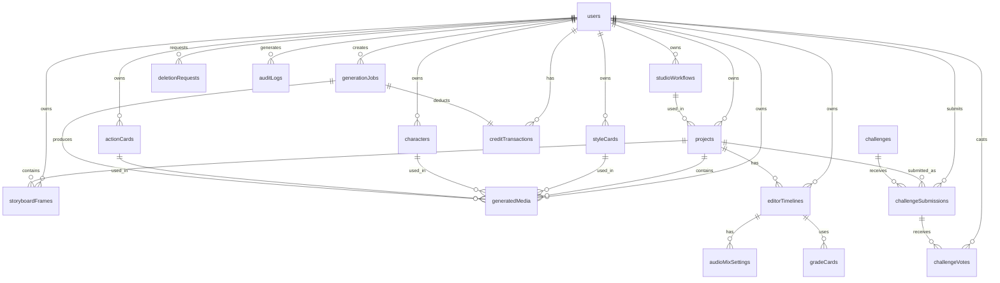

# AGENTS.md — AI Agent Operating Manual
# FilmGen
## v1.0 | June 2026

> This is the single most important document in the repo. It is included in every AI agent context window. Every rule here is a hard constraint. Violating any rule requires human approval.

---

## 1. Tech Stack (Locked)

| Layer | Technology | Version | Purpose |
|---|---|---|---|
| Framework | Next.js | 15.5.x (App Router) | Frontend + API routes |
| Runtime UI | React / React DOM | 19.2.x | Client and server component rendering |
| Language | TypeScript | 5.9.x | Type safety across all code |
| Styling | Tailwind CSS | 3.4.x | Utility-first CSS |
| Components | shadcn/ui | Latest | Base UI primitives |
| Animation | Framer Motion | 12.x | Transitions, node animations |
| Client State | Zustand | 5.x | Local-first studio state |
| Database | Convex | 1.30.x | ACID DB + real-time queries + scheduling |
| Auth | Clerk | v6 | MFA, webhooks, GDPR-compliant |
| Cache/Rate Limit | Upstash Redis | Latest | HTTP-based, serverless-safe |
| File Storage (images/audio) | Convex File Storage | Built-in | Zero config, integrated |
| File Storage (video) | Cloudflare R2 via `@convex-dev/r2` | Latest | No egress fees, S3-compatible |
| Payments | Paddle | Latest | Merchant of Record, global tax |
| Queue Workers | Railway + BullMQ | Latest | Persistent processes for AI jobs |
| Hosting (Frontend) | Vercel | Latest | Edge, zero-config |
| Email | Resend | Latest | Transactional email |
| Monitoring | Sentry | Latest | Error tracking |
| Editor (fast ops) | MediaBunny (`mediadrop`) | Latest | WebCodecs, hardware-accelerated |
| Editor (export) | ffmpeg.wasm (`@ffmpeg/ffmpeg`) | Latest | Universal browser support, filter chains |
| Node Editor | React Flow | Latest | Canvas-based node graph UI |
| AI Video | Seedance 2.0 via fal.ai | API | 1080p, 9 ref images, 15s clips |
| AI Images (default) | Nano Banana 2 via Replicate/Gemini | API | 14 refs, 5-character consistency, 4K |
| AI Images (premium) | GPT Image 2 via OpenAI | API | 4K, reasoning mode, expensive |

**No substitutions without updating this document.**

Current implementation note: the root studio currently shows a native editor placeholder in the Editing tab. FreeCut is no longer served or built by the root studio. MediaBunny/ffmpeg are planned stack entries from the larger roadmap, but they are not active in the root studio surface.

---

## 2. Project Structure

```
/
├── app/                          # Next.js App Router
│   ├── (auth)/                   # Auth group (sign-in, sign-up)
│   ├── (dashboard)/              # Dashboard group
│   ├── api/                      # API routes (webhooks, health, enqueue)
│   ├── editor/                   # Video editor page
│   ├── workspace/                # Amateur + Director workspaces
│   ├── cards/                    # Card creation UIs
│   ├── challenges/               # Film challenges
│   └── layout.tsx                # Root layout with ClerkProvider
├── components/                   # React components
│   ├── ui/                       # shadcn/ui primitives (DO NOT MODIFY)
│   ├── cards/                    # Card system components
│   ├── workspace/                # Amateur + Director workspace components
│   ├── editor/                   # Editor components (timeline, preview, controls)
│   ├── nodes/                    # React Flow custom nodes
│   └── challenges/               # Challenge UI components
├── lib/                          # Utility libraries
│   ├── ai/                       # AI provider abstraction
│   │   ├── types.ts              # AIProvider interface
│   │   ├── seedance.ts           # Seedance 2.0 / fal.ai
│   │   ├── nanobanana.ts         # Nano Banana 2 / Replicate
│   │   ├── gpt-image.ts          # GPT Image 2 / OpenAI
│   │   └── index.ts              # Provider exports
│   ├── payments/                 # Payment abstraction
│   │   ├── types.ts              # PaymentProvider interface
│   │   ├── paddle.ts             # Paddle implementation
│   │   └── index.ts              # payments export (swap for Stripe here)
│   ├── storage/                  # Storage abstraction
│   │   ├── types.ts              # StorageProvider interface
│   │   ├── convex-storage.ts     # Images/audio
│   │   ├── r2-storage.ts         # Video files
│   │   └── index.ts              # getStorage(category)
│   ├── queue/                    # Job queue abstraction
│   │   ├── types.ts              # JobQueue interface
│   │   ├── railway-http.ts       # Vercel → Railway HTTP enqueue
│   │   └── index.ts              # queue export
│   ├── cache.ts                  # Upstash Redis caching
│   ├── ratelimit.ts              # Rate limiters
│   ├── env.ts                    # Zod env validation (server-side)
│   └── cors.ts                   # CORS utilities
├── convex/                       # Convex backend
│   ├── schema.ts                 # Database schema (single source of truth)
│   ├── auth.ts                   # Auth helpers
│   ├── users.ts                  # User queries/mutations
│   ├── projects.ts               # Project CRUD
│   ├── cards.ts                  # Card system (style, storyboard, action, actor)
│   ├── generationJobs.ts         # AI generation job lifecycle
│   ├── credits.ts                # Credit system (atomic)
│   ├── webhooks.ts               # Paddle + Clerk webhook processing
│   ├── editor.ts                 # Editor timeline + audio mix
│   ├── challenges.ts             # Film challenges
│   ├── deletion.ts               # GDPR deletion flow
│   ├── crons.ts                  # Scheduled jobs (credit reset, cleanup)
│   └── _generated/               # Auto-generated by `npx convex dev`
├── worker/                       # Railway BullMQ worker
│   ├── src/
│   │   ├── server.ts             # HTTP server (enqueue endpoint)
│   │   ├── queue.ts              # BullMQ queue instance
│   │   ├── processor.ts          # Job processor
│   │   ├── seedance-worker.ts    # Seedance generation worker
│   │   ├── image-worker.ts       # Nano Banana / GPT Image worker
│   │   ├── scoreWorker.ts        # AI score generation (stub for v2)
│   │   └── convex-client.ts      # ConvexHttpClient for Railway
│   ├── package.json
│   └── tsconfig.json
├── src/                          # Additional source (non-Next.js)
│   └── editor/                   # Editor-specific logic
│       ├── export/
│       │   ├── types.ts          # ExportProvider interface
│       │   ├── browser.ts        # ffmpeg.wasm browser export
│       │   └── index.ts          # exportProvider export
│       ├── audio/                # Audio processing
│       └── filters/              # Filter/preset definitions
├── docs/                         # Documentation (NOT for agents)
│   ├── ai/                       # Agent specs (this folder)
│   │   ├── specs/                # Feature specs
│   │   ├── skills/               # Lazy-loaded skill files
│   │   ├── BRD.md
│   │   ├── PRD.md
│   │   ├── AGENTS.md
│   │   ├── DESIGN.md
│   │   ├── ARCHITECTURE.md
│   │   ├── API_SPEC.md
│   │   ├── AI_PIPELINE.md
│   │   ├── SECURITY.md
│   │   ├── DATABASE_SCHEMA.md
│   │   ├── tasks.md
│   │   └── NOTES.md
│   └── legal/                    # Privacy, ToS, DPA
├── public/                       # Static assets
├── .env.example                  # Key names only (committed)
├── .cursorrules                  # Symlink to AGENTS.md
├── .cursorignore                 # Exclude from agent context
├── next.config.ts                # Next.js config (COOP/COEP headers)
├── middleware.ts                 # Clerk auth middleware
├── tailwind.config.ts            # Tailwind config
└── package.json
```

---

## 3. Naming Conventions

### 3.1 Files
- **React components:** PascalCase (`ActorCard.tsx`, `DirectorWorkspace.tsx`)
- **Utility/hook files:** camelCase (`useAuth.ts`, `formatCredits.ts`)
- **API routes:** kebab-case (`route.ts` inside `app/api/webhooks/paddle/`)
- **Convex files:** camelCase matching table (`cards.ts`, `generationJobs.ts`)
- **CSS modules:** kebab-case (`card-chat.module.css`) — prefer Tailwind

### 3.2 Code
- **Variables / functions:** camelCase (`generateVideo`, `creditBalance`)
- **Types / interfaces:** PascalCase (`ImageParams`, `ExportProvider`)
- **Constants:** UPPER_SNAKE_CASE (`MAX_REF_IMAGES`, `FILE_SIZE_LIMITS`)
- **Convex table names:** camelCase plural (`users`, `styleCards`, `generationJobs`)
- **Convex index names:** `by_fieldName` (`by_clerk_id`, `by_owner`)

### 3.3 Database Fields
- Use `createdAt` (timestamp ms), `updatedAt` (timestamp ms)
- Use `ownerId` for user ownership (foreign key to `users._id`)
- Use `status` enums with `v.union(v.literal(...))`
- Use `r2Key` for R2 references (never `r2Url` — URLs expire)
- Use `convexStorageId` for Convex file references (`v.id('_storage')`)

---

## 4. Commands

| Command | Purpose | When to Run |
|---|---|---|
| `npm run dev` | Start Next.js dev server | Local development |
| `npx convex dev` | Start Convex dev server + codegen | Local development (run in separate terminal) |
| `npm run build` | Production build | Before every Vercel deploy |
| `npm run typecheck` | TypeScript check | Pre-commit, CI |
| `npm run lint` | ESLint | Pre-commit, CI |
| `npm run test` | Jest / Vitest | Pre-commit, CI |
| `npm run convex:deploy` | Deploy Convex functions to production | Manual or CI |

---

## 5. Hard Rules (Never Violate)

### 5.1 Security
- **NEVER** put API keys, secrets, or tokens in `NEXT_PUBLIC_` env vars. Only `NEXT_PUBLIC_APP_URL`, `NEXT_PUBLIC_CLERK_PUBLISHABLE_KEY`, `NEXT_PUBLIC_PADDLE_CLIENT_TOKEN` are allowed as public.
- **NEVER** store AI provider keys (OpenAI, fal.ai, Replicate) in client-side code or expose them via API response.
- **NEVER** use `dangerouslySetInnerHTML` with AI-generated content. Always sanitize or render as plain text.
- **NEVER** store R2 presigned URLs in the database. Store `r2Key` only. Generate URLs on demand via `getStorage('video').getFileUrl(key)`.
- **NEVER** use user-provided filenames as storage keys. Always use UUIDs (`crypto.randomUUID()`).
- **NEVER** skip webhook signature verification. Reject unsigned Paddle/Clerk webhooks with 401 before reading body.
- **NEVER** declare credit-modifying functions as public `mutation`. They must be `internalMutation` — callable only by other Convex functions.
- **NEVER** skip `getUserIdentity()` + ownership check in any Convex mutation or query that touches user data.
- **NEVER** use wildcard CORS. Explicit origin allowlist only.

### 5.2 Architecture
- **NEVER** call BullMQ directly from Vercel API routes. Always enqueue via Railway HTTP endpoint (`POST /enqueue` with `X-Worker-Secret`).
- **NEVER** run AI generation calls inside Vercel API routes (timeout risk: 10s Hobby / 60s Pro). All AI calls happen in Railway workers or Convex actions only.
- **NEVER** cache user credits in Redis. Use Convex `useQuery(api.users.getCredits)` for real-time reactive updates.
- **NEVER** use `req.ip` for rate limiting on Vercel. Use `x-forwarded-for` header.
- **NEVER** commit `.env.local`, `.env.production`, or `worker/.env` with real values. Only `.env.example` (key names, empty values) is committed.
- **NEVER** run staging and production on the same Convex deployment. Separate deployments always.

### 5.3 Code Quality
- **NEVER** use `any` in TypeScript unless absolutely unavoidable. Prefer `unknown` + type guards.
- **NEVER** modify files inside `components/ui/` (shadcn/ui primitives). Extend or wrap them instead.
- **NEVER** write business logic in Next.js API route handlers. Route handlers validate + delegate to Convex/lib functions.
- **NEVER** use `console.log` in production code. Use `console.error` for errors or a proper logger.
- **NEVER** leave `TODO` or `FIXME` in committed code without a `tasks.md` entry. Either fix it or document it.

### 5.4 AI / Prompts
- **NEVER** concatenate user input into system prompt strings. Always use structured message arrays with explicit `role` fields (`system`, `user`).
- **NEVER** treat `sanitizePrompt()` regex as primary security. It is defense-in-depth only. Structured roles are the real defense.
- **NEVER** send unsanitized user prompts directly to AI providers without validation (Zod schema + length limits).

## AGENTS.md 窶・Section 5 Append-Only Rules (Add to existing AGENTS.md)

### 5.5 Version Lock (Updated June 2026)
- Next.js 15.5.x, React 19.2.x, TypeScript 5.9.x are the locked frontend versions.
- The Editing tab is intentionally a native placeholder after human-approved FreeCut removal. Do not introduce MediaBunny/ffmpeg.wasm or another active editor without human approval.
- If upgrading versions, update this document and run full `npm run typecheck && npm run test && npm run build` before committing.

### 5.6 Clerk Auth (Mandatory)
- All dashboard routes use `auth.protect()` in `middleware.ts`.
- Server components use `currentUser()` from `@clerk/nextjs/server`.
- Client components use `useAuth()` from `@clerk/nextjs`.
- Never call `auth()` without `await` in Clerk v5/v6.

### 5.7 Convex Integration (Frontend Phase)
- Frontend reads from Convex via `useQuery` only after backend mutations are implemented.
- Until backend is live, local Zustand stores remain the source of truth for UI state.
- When backend is ready, migrate store persistence to Convex mutations incrementally 窶・never delete local stores until Convex queries are verified.

### 5.8 Abstraction Layer Stubs
- `lib/ai/`, `lib/payments/`, `lib/storage/`, `lib/queue/` contain stub implementations matching the documented interfaces.
- Do not build business logic that depends on stub behavior (e.g., do not assume `generateVideo()` returns a real URL).
- Stubs must be replaced with real implementations during backend phase without changing their exported interfaces.

### 5.9 Editor Surface Security
- External editor embeds are not active in the root studio. If one is reintroduced, all `postMessage` handlers must validate `event.origin === window.location.origin`.
- Never use `postMessage(..., "*")` in production.
- Legacy `/freecut-editor/` service workers must be unregistered when users visit the native editor placeholder.

### 5.10 Mobile Navigation (Non-Negotiable)
- Studio tabs must be accessible via hamburger menu below `md` breakpoint.
- Project selection must be accessible on mobile.
- Test all studio tabs on 375px width before committing UI changes.

---

## 6. Database Diagram (Mermaid)



---

## 7. Environment Variables

All secrets managed via **Doppler** (or equivalent). Never paste real values into `.env.local` or Vercel/Railway dashboards directly.

**`.env.example` — committed, values empty:**

```bash
# Convex
CONVEX_DEPLOYMENT=
NEXT_PUBLIC_CONVEX_URL=
CONVEX_URL=
CONVEX_DEPLOY_KEY=

# Clerk Auth
NEXT_PUBLIC_CLERK_PUBLISHABLE_KEY=
CLERK_SECRET_KEY=
NEXT_PUBLIC_CLERK_SIGN_IN_URL=/sign-in
NEXT_PUBLIC_CLERK_SIGN_UP_URL=/sign-up
NEXT_PUBLIC_CLERK_AFTER_SIGN_IN_URL=/studio
NEXT_PUBLIC_CLERK_AFTER_SIGN_UP_URL=/studio
CLERK_WEBHOOK_SECRET=

# Upstash Redis
UPSTASH_REDIS_REST_URL=
UPSTASH_REDIS_REST_TOKEN=

# Cloudflare R2
CLOUDFLARE_ACCOUNT_ID=
R2_ACCESS_KEY_ID=
R2_SECRET_ACCESS_KEY=
R2_BUCKET_NAME=
R2_PUBLIC_URL=

# Paddle
PADDLE_API_KEY=
PADDLE_WEBHOOK_SECRET=
NEXT_PUBLIC_PADDLE_CLIENT_TOKEN=
PADDLE_ENVIRONMENT=sandbox

# Railway Worker
RAILWAY_WORKER_URL=
RAILWAY_WORKER_SECRET=

# AI Providers (server-side ONLY)
FAL_KEY=                    # Seedance 2.0
REPLICATE_API_TOKEN=        # Nano Banana 2
OPENAI_API_KEY=             # GPT Image 2

# Email
RESEND_API_KEY=

# App
NEXT_PUBLIC_APP_URL=
NODE_ENV=

# Cron
CRON_SECRET=

# Sentry (optional until 100+ users)
NEXT_PUBLIC_SENTRY_DSN=
SENTRY_AUTH_TOKEN=
```

---

## 8. Testing Checklist (Before Every Commit)

- [ ] `npm run typecheck` — zero errors
- [ ] `npm run lint` — zero errors
- [ ] `npm run test` — zero failures
- [ ] `npm run build` — clean
- [ ] Every new Convex mutation has `getUserIdentity()` + ownership check
- [ ] Every new API route has rate limiter applied (except webhooks)
- [ ] No secrets in `NEXT_PUBLIC_` except the 3 allowed keys
- [ ] No `any` types without comment explaining why
- [ ] No `TODO` without `tasks.md` entry

---

## 9. Agent Memory Protocol

When you finish a task:
1. Update `tasks.md` — check off completed items
2. Update `NOTES.md` — log decisions, gotchas, and current status
3. If you discovered a new rule (e.g., "never use X pattern because Y"), add it to Section 5 of this file
4. If you modified the schema, update `DATABASE_SCHEMA.md` and the Mermaid diagram above

---

*Document Owner: FilmGen Engineering*  
*Last Updated: June 2026*  
*Next Review: Weekly or after any stack change*
